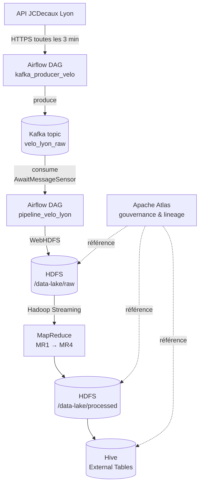

# Data Lake Vélo Lyon

Énoncé du TP : [ENONCE.md](ENONCE.md)

> **Avertissement** : cet environnement est destiné au développement local uniquement. Ne pas utiliser en production (mots de passe en clair, ports exposés sans authentification, pas de haute disponibilité).

## Architecture

### Flux de données



### Rôle de chaque conteneur

**Stockage et calcul Hadoop**
| Conteneur | Rôle |
|---|---|
| `namenode` | Métadonnées HDFS et point d'entrée du filesystem distribué |
| `datanode` | Stockage physique des blocs HDFS |
| `resourcemanager` | Orchestrateur YARN, alloue les ressources aux jobs |
| `nodemanager` | Exécute les tâches YARN (mappers/reducers) |
| `historyserver` | Historique des jobs MapReduce terminés |

**Hive**
| Conteneur | Rôle |
|---|---|
| `hive-metastore-db` | Postgres dédié au stockage des métadonnées Hive |
| `hive-metastore` | Service Thrift exposant les métadonnées Hive |
| `hive-server` | HiveServer2, point d'entrée JDBC/ODBC pour les requêtes SQL |

**Streaming et gouvernance**
| Conteneur | Rôle |
|---|---|
| `kafka` | Broker Kafka en mode KRaft (sans ZooKeeper), tampon producer/consumer |
| `atlas` | Catalogue de métadonnées et lineage des datasets |

**Airflow**
| Conteneur | Rôle |
|---|---|
| `postgres-airflow` | Postgres dédié à Airflow (état des DAGs, runs, connexions) |
| `airflow-init` | Initialisation (migration DB, création admin), s'arrête après exécution |
| `airflow-webserver` | Interface web d'Airflow |
| `airflow-scheduler` | Scheduler qui déclenche les DAGs et tâches |
| `airflow-triggerer` | Gestion des opérateurs deferrable (`AwaitMessageSensor`…) |

**Développement**
| Conteneur | Rôle |
|---|---|
| `dev` | Environnement Python complet pour développer/déboguer les scripts du projet sur le réseau Docker `data-net` |

## Démarrage

```bash
# Renseigner votre UID (nécessaire pour Airflow et le conteneur de dev)
echo "AIRFLOW_UID=$(id -u)" >> .env

# Lancer les services
docker compose up -d
```

Les DAGs Airflow sont à placer dans le répertoire `dag/` à la racine du projet.

## Environnement de développement

Un conteneur `dev` a été ajouté à la stack. Il embarque Python 3.12, Airflow 2.10.5 et debugpy, et est monté sur le répertoire racine du projet.

Les images Hadoop (`bde2020`) et Hive ne disposent pas d'environnement Python exploitable pour le développement. Écrire et déboguer les scripts depuis la machine locale poserait un problème de résolution DNS : les services de la stack (`namenode`, `kafka`, `postgres-airflow`…) ne sont accessibles que depuis l'intérieur du réseau Docker `data-net`.

Le conteneur `dev` résout les deux problèmes : il est sur `data-net` et peut donc joindre tous les services par leur nom, tout en offrant un environnement Python complet. VS Code s'y connecte via l'extension Dev Containers (`Ctrl+Shift+P` → *Reopen in Container*), ce qui permet d'éditer, exécuter et déboguer les scripts avec des breakpoints.

## Initialisation du data lake HDFS

Les répertoires HDFS sont créés via l'API REST WebHDFS exposée par le namenode sur le port 9870.

Ces commandes sont exécutées depuis le conteneur `dev` car le namenode n'est pas accessible par son nom de service (`namenode`) en dehors du réseau Docker `data-net`. Depuis l'hôte, le port 9870 est bien exposé mais WebHDFS effectue des redirections internes vers le datanode (non exposé), ce qui provoquerait des erreurs. Passer par le conteneur `dev` évite ce problème de résolution réseau.

Une alternative équivalente aurait été de passer par `docker exec` directement sur le namenode, sans passer par WebHDFS :

```bash
docker exec namenode hdfs dfs -mkdir -p /data-lake/raw /data-lake/processed /data-lake/analytics
```

```bash
# Créer les trois répertoires du data lake
curl -X PUT "http://namenode:9870/webhdfs/v1/data-lake/raw?op=MKDIRS&user.name=root"
curl -X PUT "http://namenode:9870/webhdfs/v1/data-lake/processed?op=MKDIRS&user.name=root"
curl -X PUT "http://namenode:9870/webhdfs/v1/data-lake/analytics?op=MKDIRS&user.name=root"
```

Chaque commande renvoie `{"boolean":true}` en cas de succès.

```bash
# Vérifier l'arborescence créée
curl "http://namenode:9870/webhdfs/v1/data-lake?op=LISTSTATUS&user.name=root"
```

L'arborescence est aussi consultable depuis l'interface web HDFS : http://localhost:9870 → *Utilities > Browse the file system*.

## Kafka

Kafka joue le rôle de tampon entre l'API JCDecaux et le stockage HDFS. Un producer Python interroge l'API toutes les 3 minutes et publie chaque réponse JSON dans le topic `velo_lyon_raw`. Le découplage entre production et consommation permet d'absorber les variations de débit de l'API sans bloquer le pipeline de traitement.

### Topic

Le topic `velo_lyon_raw` a été créé avec la commande suivante :

```bash
docker exec kafka kafka-topics --bootstrap-server kafka:9092 \
  --create --topic velo_lyon_raw \
  --partitions 1 --replication-factor 1
```

### Producer

La logique du producer est dans [kafka_producer.py](kafka_producer.py) : la fonction `fetch_and_publish()` interroge l'API JCDecaux et publie le snapshot JSON dans le topic. Le module reste exécutable en standalone (`python kafka_producer.py` depuis le conteneur dev) pour effectuer un cycle ponctuel à des fins de test. La périodicité est uniquement assurée par le DAG Airflow.

Le DAG [dag/kafka_producer_dag.py](dag/kafka_producer_dag.py) s'exécute toutes les 3 minutes et appelle `fetch_and_publish()`. Il bénéficie de la gestion native d'Airflow (retries, monitoring, alertes) et reste indépendant du DAG consumer.

### Consumer

La logique du consumer est dans [kafka_consumer.py](kafka_consumer.py) : la fonction `consume_and_write_hdfs()` consomme tous les messages disponibles dans le topic et écrit le dernier snapshot dans HDFS sous `/data-lake/raw/velo_lyon/YYYY-MM-DD-HH/stations_HHMMSS.json`. Les offsets Kafka sont commités après chaque écriture pour éviter les doublons. Comme le producer, le module est exécutable en standalone (`python kafka_consumer.py`) pour effectuer un cycle ponctuel à des fins de test.

Le DAG [dag/pipeline_velo.py](dag/pipeline_velo.py) s'exécute toutes les 3 minutes mais est complètement découplé du producer. Il utilise un `AwaitMessageSensor` *deferrable* pour surveiller le topic `velo_lyon_raw` : pendant l'attente, la tâche n'occupe aucun worker Airflow — c'est le service `airflow-triggerer` qui prend le relais via un mécanisme asynchrone. Dès que des messages sont disponibles, la tâche `ecrire_hdfs` appelle `consume_and_write_hdfs()`.

### Configuration Airflow

L'image Airflow a été étendue ([Dockerfile.airflow](Dockerfile.airflow)) pour inclure `apache-airflow-providers-apache-kafka`. La connexion Kafka est configurée via la variable d'environnement `AIRFLOW_CONN_KAFKA_DEFAULT`. La racine du projet est montée en read-only sur `/opt/airflow/lib` et ce chemin est ajouté au `PYTHONPATH`, ce qui rend tous les modules Python de la racine (`kafka_producer.py`, `kafka_consumer.py`, mappers/reducers…) directement importables depuis les DAGs sans avoir à modifier le compose.

## Fichiers Python

| Fichier | Rôle | Exécution manuelle (conteneur dev) | Exécution via Airflow |
|---|---|---|---|
| [kafka_producer.py](kafka_producer.py) | Fetch JCDecaux + publish Kafka | `python kafka_producer.py` → un cycle | DAG `kafka_producer_velo` → `fetch_and_publish()` (toutes les 3 min) |
| [kafka_consumer.py](kafka_consumer.py) | Consume Kafka + write HDFS | `python kafka_consumer.py` → un cycle | DAG `pipeline_velo_lyon` → `consume_and_write_hdfs()` (déclenché par sensor) |
| [mapper_load_factor.py](mapper_load_factor.py), [reducer_load_factor.py](reducer_load_factor.py) | MR1 — load factor + validation | Validation : `cat sample.json \| python mapper_load_factor.py` | À déclencher via Hadoop Streaming dans un futur DAG |
| [mapper_anomalies.py](mapper_anomalies.py), [reducer_anomalies.py](reducer_anomalies.py) | MR2 — détection anomalies | idem | idem |
| [mapper_horaire.py](mapper_horaire.py), [reducer_horaire.py](reducer_horaire.py) | MR3 — agrégats horaire/quartier | idem | idem |
| [mapper_heatmap.py](mapper_heatmap.py), [reducer_heatmap.py](reducer_heatmap.py) | MR4 — heatmap stratégique | idem | idem |

**Fichiers DAG** (chargés par Airflow, non exécutables manuellement) :
- [dag/kafka_producer_dag.py](dag/kafka_producer_dag.py) → importe et appelle `kafka_producer.fetch_and_publish`
- [dag/pipeline_velo.py](dag/pipeline_velo.py) → importe et appelle `kafka_consumer.consume_and_write_hdfs`

## URLs disponibles

### Interfaces web

| Service | URL | Description |
|---|---|---|
| **HDFS NameNode** | http://localhost:9870 | Interface web du système de fichiers distribué HDFS |
| **YARN ResourceManager** | http://localhost:8088 | Interface de gestion des ressources et des jobs MapReduce |
| **YARN History Server** | http://localhost:8188 | Historique des jobs MapReduce terminés |
| **Apache Atlas** | http://localhost:21000 | Gouvernance des données et catalogage des métadonnées |
| **Airflow** | http://localhost:8080 | Orchestration des pipelines (admin / admin) |

### Connexions non-HTTP (clients programmatiques)

| Service | Adresse | Description |
|---|---|---|
| **HDFS** | `hdfs://localhost:9000` | Accès au filesystem |
| **Hive Metastore** | `localhost:9083` | Thrift endpoint pour Hive |
| **HiveServer2** | `localhost:10000` | Connexion JDBC/ODBC à Hive |
| **Kafka** | `localhost:9092` | Broker Kafka (KRaft mode) |
| **PostgreSQL Airflow** | `localhost:5432` | Base de données Airflow (user: `airflow`, password: `airflow`, db: `airflow`) |
