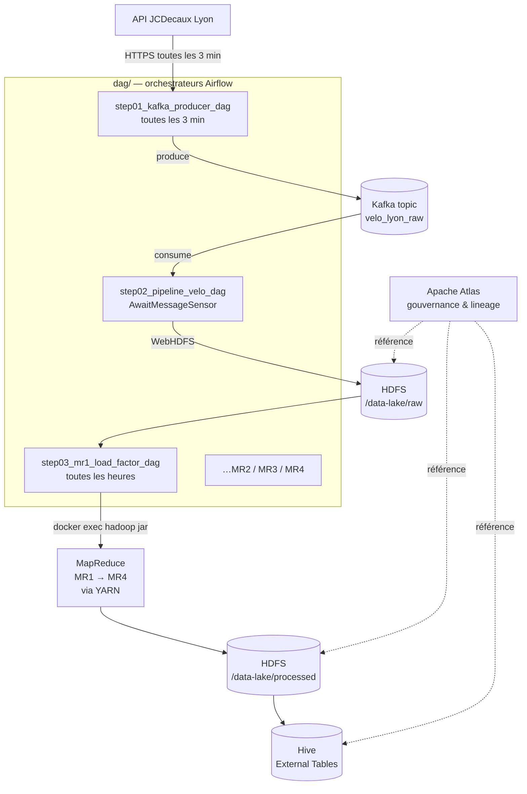

# Data Lake Vélo Lyon

Énoncé du TP : [ENONCE.md](ENONCE.md)

> **Avertissement** : cet environnement est destiné au développement local uniquement. Ne pas utiliser en production (mots de passe en clair, ports exposés sans authentification, pas de haute disponibilité).

## Architecture

### Organisation du code

Le code Python est séparé en deux parties :

- **À la racine** : les modules contenant la logique métier (fetch JCDecaux, écriture HDFS, mappers/reducers Hadoop Streaming…). Ils sont nommés `stepNN_<rôle>.py` et restent exécutables en standalone pour les tests dans le conteneur `dev`.
- **Dans `dag/`** : les fichiers DAG Airflow, qui ne contiennent **pas** de logique métier mais uniquement de l'orchestration. Ils importent ou invoquent les modules de la racine. Ils sont nommés `stepNN_<rôle>_dag.py`.

Cette séparation permet de tester chaque étape du pipeline indépendamment d'Airflow et de garder les DAGs minces.

### Flux de données



### Rôle de chaque conteneur

**Stockage et calcul Hadoop**
| Conteneur | Rôle |
|---|---|
| `namenode` | Métadonnées HDFS et point d'entrée du filesystem distribué |
| `datanode` | Stockage physique des blocs HDFS |
| `resourcemanager` | Orchestrateur YARN, alloue les ressources aux jobs |
| `nodemanager` | Exécute les tâches YARN (mappers/reducers) |
| `historyserver` | Historique des jobs MapReduce terminés |

**Hive**
| Conteneur | Rôle |
|---|---|
| `hive-metastore-db` | Postgres dédié au stockage des métadonnées Hive |
| `hive-metastore` | Service Thrift exposant les métadonnées Hive |
| `hive-server` | HiveServer2, point d'entrée JDBC/ODBC pour les requêtes SQL |

**Streaming et gouvernance**
| Conteneur | Rôle |
|---|---|
| `kafka` | Broker Kafka en mode KRaft (sans ZooKeeper), tampon producer/consumer |
| `atlas` | Catalogue de métadonnées et lineage des datasets |

**Airflow**
| Conteneur | Rôle |
|---|---|
| `postgres-airflow` | Postgres dédié à Airflow (état des DAGs, runs, connexions) |
| `airflow-init` | Initialisation (migration DB, création admin), s'arrête après exécution |
| `airflow-webserver` | Interface web d'Airflow |
| `airflow-scheduler` | Scheduler qui déclenche les DAGs et tâches |
| `airflow-triggerer` | Gestion des opérateurs deferrable (`AwaitMessageSensor`…) |

**Développement**
| Conteneur | Rôle |
|---|---|
| `dev` | Environnement Python complet pour développer/déboguer les scripts du projet sur le réseau Docker `data-net` |

## Démarrage

```bash
# Renseigner votre UID (nécessaire pour Airflow et le conteneur de dev)
echo "AIRFLOW_UID=$(id -u)" >> .env

# Renseigner la clé API JCDecaux (à obtenir sur https://developer.jcdecaux.com)
echo "JCDECAUX_API_KEY=votre_clé_ici" >> .env

# Lancer les services
docker compose up -d
```

Les variables d'environnement attendues sont documentées dans [.env.example](.env.example). Les DAGs Airflow vivent dans le répertoire dédié [dag/](dag/) à la racine du projet — ils sont chargés automatiquement par Airflow via le mount `./dag:/opt/airflow/dags`.

## Environnement de développement

Un conteneur `dev` a été ajouté à la stack. Il embarque Python 3.12, Airflow 2.10.5 et debugpy, et est monté sur le répertoire racine du projet.

Les images Hadoop (`bde2020`) et Hive ne disposent pas d'environnement Python exploitable pour le développement. Écrire et déboguer les scripts depuis la machine locale poserait un problème de résolution DNS : les services de la stack (`namenode`, `kafka`, `postgres-airflow`…) ne sont accessibles que depuis l'intérieur du réseau Docker `data-net`.

Le conteneur `dev` résout les deux problèmes : il est sur `data-net` et peut donc joindre tous les services par leur nom, tout en offrant un environnement Python complet. VS Code s'y connecte via l'extension Dev Containers (`Ctrl+Shift+P` → *Reopen in Container*), ce qui permet d'éditer, exécuter et déboguer les scripts avec des breakpoints.

## Initialisation du data lake HDFS

Les répertoires HDFS sont créés via l'API REST WebHDFS exposée par le namenode sur le port 9870.

Ces commandes sont exécutées depuis le conteneur `dev` car le namenode n'est pas accessible par son nom de service (`namenode`) en dehors du réseau Docker `data-net`. Depuis l'hôte, le port 9870 est bien exposé mais WebHDFS effectue des redirections internes vers le datanode (non exposé), ce qui provoquerait des erreurs. Passer par le conteneur `dev` évite ce problème de résolution réseau.

Une alternative équivalente aurait été de passer par `docker exec` directement sur le namenode, sans passer par WebHDFS :

```bash
docker exec namenode hdfs dfs -mkdir -p /data-lake/raw /data-lake/processed /data-lake/analytics
```

```bash
# Créer les trois répertoires du data lake
curl -X PUT "http://namenode:9870/webhdfs/v1/data-lake/raw?op=MKDIRS&user.name=root"
curl -X PUT "http://namenode:9870/webhdfs/v1/data-lake/processed?op=MKDIRS&user.name=root"
curl -X PUT "http://namenode:9870/webhdfs/v1/data-lake/analytics?op=MKDIRS&user.name=root"
```

Chaque commande renvoie `{"boolean":true}` en cas de succès.

```bash
# Vérifier l'arborescence créée
curl "http://namenode:9870/webhdfs/v1/data-lake?op=LISTSTATUS&user.name=root"
```

L'arborescence est aussi consultable depuis l'interface web HDFS : http://localhost:9870 → *Utilities > Browse the file system*.

## Kafka

Kafka joue le rôle de tampon entre l'API JCDecaux et le stockage HDFS. Un producer Python interroge l'API toutes les 3 minutes et publie chaque réponse JSON dans le topic `velo_lyon_raw`. Le découplage entre production et consommation permet d'absorber les variations de débit de l'API sans bloquer le pipeline de traitement.

### Topic

Le topic `velo_lyon_raw` a été créé avec la commande suivante :

```bash
docker exec kafka kafka-topics --bootstrap-server kafka:9092 \
  --create --topic velo_lyon_raw \
  --partitions 1 --replication-factor 1
```

### Producer

La logique du producer est dans [step01_kafka_producer.py](step01_kafka_producer.py) : la fonction `fetch_and_publish()` interroge l'API JCDecaux et publie le snapshot JSON dans le topic. Le module reste exécutable en standalone (`python step01_kafka_producer.py` depuis le conteneur dev) pour effectuer un cycle ponctuel à des fins de test. La périodicité est uniquement assurée par le DAG Airflow.

Le DAG [dag/step01_kafka_producer_dag.py](dag/step01_kafka_producer_dag.py) s'exécute toutes les 3 minutes et appelle `fetch_and_publish()`. Il bénéficie de la gestion native d'Airflow (retries, monitoring, alertes) et reste indépendant du DAG consumer.

### Consumer

La logique du consumer est dans [step02_kafka_consumer.py](step02_kafka_consumer.py) : la fonction `consume_and_write_hdfs()` consomme tous les messages disponibles dans le topic et écrit le dernier snapshot dans HDFS sous `/data-lake/raw/velo_lyon/YYYY-MM-DD-HH/stations_HHMMSS.json` au **format JSONL** (une station par ligne). Ce format est requis par Hadoop Streaming qui distribue chaque ligne au mapper individuellement. Les offsets Kafka sont commités après chaque écriture pour éviter les doublons. Comme le producer, le module est exécutable en standalone (`python step02_kafka_consumer.py`) pour effectuer un cycle ponctuel à des fins de test.

Le DAG [dag/step02_pipeline_velo_dag.py](dag/step02_pipeline_velo_dag.py) s'exécute toutes les 3 minutes mais est complètement découplé du producer. Il utilise un `AwaitMessageSensor` *deferrable* pour surveiller le topic `velo_lyon_raw` : pendant l'attente, la tâche n'occupe aucun worker Airflow — c'est le service `airflow-triggerer` qui prend le relais via un mécanisme asynchrone. Dès que des messages sont disponibles, la tâche `ecrire_hdfs` appelle `consume_and_write_hdfs()`.

### Configuration Airflow

L'image Airflow a été étendue ([Dockerfile.airflow](Dockerfile.airflow)) pour inclure `apache-airflow-providers-apache-kafka`. La connexion Kafka est configurée via la variable d'environnement `AIRFLOW_CONN_KAFKA_DEFAULT`. La racine du projet est montée en read-only sur `/opt/airflow/lib` et ce chemin est ajouté au `PYTHONPATH`, ce qui rend tous les modules Python de la racine (`step01_kafka_producer.py`, `step02_kafka_consumer.py`, mappers/reducers…) directement importables depuis les DAGs sans avoir à modifier le compose.

## Étapes du pipeline

### Step 01 — Producer Kafka

**Fichier** : [step01_kafka_producer.py](step01_kafka_producer.py)

**Contexte** : point d'entrée du pipeline, ingestion temps réel des données JCDecaux.

**Objectif** : récupérer un snapshot complet des stations Vélo'v et le publier dans Kafka, pour découpler la collecte du traitement.

**Exécution** :
- Manuelle : `python step01_kafka_producer.py` depuis le conteneur `dev` (un seul cycle)
- Programmée : DAG Airflow `01_kafka_producer_velo` toutes les 3 minutes (service `airflow-scheduler`)

**Entrée** : appel HTTPS à l'API JCDecaux (`https://api.jcdecaux.com/vls/v1/stations?contract=lyon`)

**Sortie** : un message dans le topic Kafka `velo_lyon_raw` (un message = un tableau JSON de 250+ stations)

---

### Step 02 — Consumer Kafka → HDFS

**Fichier** : [step02_kafka_consumer.py](step02_kafka_consumer.py)

**Contexte** : persistance des snapshots Kafka dans le data lake HDFS au format attendu par Hadoop Streaming.

**Objectif** : transformer le tableau JSON consommé en JSONL (une station par ligne) et l'écrire dans HDFS.

**Exécution** :
- Manuelle : `python step02_kafka_consumer.py` depuis le conteneur `dev` (un seul cycle)
- Programmée : DAG Airflow `02_pipeline_velo_lyon`, déclenché par `AwaitMessageSensor` (services `airflow-scheduler` + `airflow-triggerer`)

**Entrée** : messages du topic Kafka `velo_lyon_raw` (groupe consumer `airflow-hdfs-writer`)

**Sortie** : fichier JSONL dans HDFS sous `/data-lake/raw/velo_lyon/YYYY-MM-DD-HH/stations_HHMMSS.json`

---

### Step 03 — MR1 : load factor + validation

**Fichiers** : [step03_mr1_mapper_load_factor.py](step03_mr1_mapper_load_factor.py), [step03_mr1_reducer_load_factor.py](step03_mr1_reducer_load_factor.py)

**Contexte** : premier job MapReduce, calcul d'un indicateur de remplissage par station.

**Objectif** : produire la métrique `load_factor` (ratio vélos disponibles / capacité opérationnelle) et qualifier la fiabilité de chaque relevé via `status_valide`. Les statistiques agrégées (moyenne, écart-type) sont calculées uniquement sur les échantillons valides.

**Exécution** :
- Manuelle (test) : `cat sample.jsonl | python step03_mr1_mapper_load_factor.py | sort | python step03_mr1_reducer_load_factor.py` depuis le conteneur `dev`
- Programmée : DAG Airflow `03_mr1_load_factor` (orchestré par [dag/step03_mr1_load_factor_dag.py](dag/step03_mr1_load_factor_dag.py)) qui invoque `hadoop jar ... hadoop-streaming` sur le `namenode` via `docker exec`. Les jobs s'exécutent ensuite sur le cluster YARN (`resourcemanager` + `nodemanager`).

**Entrée** : fichiers JSONL de `/data-lake/raw/velo_lyon/*` (une station par ligne)

**Sortie** :
- Mapper : `station_id\ttimestamp\tload_factor\tstatus_valide`
- Reducer : `station_id\tavg_load_factor\tstd_load\tnb_samples_valides\ttotal_samples` dans `/data-lake/processed/load_metrics/`

**Note d'architecture — choix de la méthode d'invocation Hadoop depuis Airflow**

Deux options ont été envisagées pour déclencher des jobs Hadoop Streaming depuis Airflow :

- **Option A (retenue) — `docker exec` depuis Airflow vers le namenode** : le client Hadoop déjà présent dans le namenode est invoqué via le socket Docker. Image Airflow légère (juste le CLI Docker, ~30 Mo). Inconvénient : couplage Airflow ↔ Docker (Airflow dispose d'un accès complet à Docker via le socket monté).

- **Option B (écartée) — Client Hadoop dans l'image Airflow** : architecturalement plus propre (pattern "edge node" standard, pas d'exposition du socket Docker), mais le téléchargement du tarball Hadoop 3.2.1 (~350 Mo) depuis archive.apache.org rend le build de l'image trop long pour ce TP. Option pertinente pour un usage en production.

---

### Step 04 — MR2 : détection d'anomalies _(à implémenter)_

**Fichiers** : [step04_mr2_mapper_anomalies.py](step04_mr2_mapper_anomalies.py), [step04_mr2_reducer_anomalies.py](step04_mr2_reducer_anomalies.py)

**Contexte** : alerter l'équipe maintenance avant que les usagers ne se plaignent.

**Objectif** : détecter trois types d'anomalies (`NO_UPDATE`, `ZERO_BIKES`, `FULL_STANDS`) et calculer un score de fiabilité par station.

**Exécution** : Hadoop Streaming via le `nodemanager` (programmée) ou pipeline shell équivalent dans `dev` (manuelle).

**Entrée** : fichiers JSONL de `/data-lake/raw/velo_lyon/*`

**Sortie** : `/data-lake/processed/anomalies/` (à confirmer lors de l'implémentation)

---

### Step 05 — MR3 : agrégats horaire/quartier _(à implémenter)_

**Fichiers** : [step05_mr3_mapper_horaire.py](step05_mr3_mapper_horaire.py), [step05_mr3_reducer_horaire.py](step05_mr3_reducer_horaire.py)

**Contexte** : prédiction des pics de demande par quartier et créneau horaire.

**Objectif** : calculer le 95e percentile du `load_factor` par couple (heure, quartier) ainsi que la capacité totale.

**Exécution** : Hadoop Streaming via le `nodemanager` (programmée) ou pipeline shell équivalent dans `dev` (manuelle).

**Entrée** : fichiers JSONL de `/data-lake/raw/velo_lyon/*`

**Sortie** : `/data-lake/processed/horaire/` (à confirmer lors de l'implémentation)

---

### Step 06 — MR4 : heatmap stratégique _(à implémenter)_

**Fichiers** : [step06_mr4_mapper_heatmap.py](step06_mr4_mapper_heatmap.py), [step06_mr4_reducer_heatmap.py](step06_mr4_reducer_heatmap.py)

**Contexte** : aide à la décision pour l'arbitrage d'investissement de 5M€.

**Objectif** : identifier les quartiers prioritaires et les stations sous-équipées en croisant utilisation et chiffre d'affaires potentiel.

**Exécution** : Hadoop Streaming via le `nodemanager` (programmée) ou pipeline shell équivalent dans `dev` (manuelle).

**Entrée** : sortie de MR1 (load factor par station) et données stations enrichies

**Sortie** : `/data-lake/analytics/heatmap/` (à confirmer lors de l'implémentation)

---

### DAGs Airflow

Les fichiers du dossier `dag/` ne sont pas des étapes du pipeline mais des **orchestrateurs** chargés par Airflow.

- [dag/step01_kafka_producer_dag.py](dag/step01_kafka_producer_dag.py) — orchestre Step 01 ; importe et appelle `step01_kafka_producer.fetch_and_publish` toutes les 3 minutes
- [dag/step02_pipeline_velo_dag.py](dag/step02_pipeline_velo_dag.py) — orchestre Step 02 ; surveille Kafka avec un `AwaitMessageSensor` puis appelle `step02_kafka_consumer.consume_and_write_hdfs`
- [dag/step03_mr1_load_factor_dag.py](dag/step03_mr1_load_factor_dag.py) — orchestre Step 03 (MR1) ; invoque `hadoop jar` sur le namenode toutes les heures via `docker exec` (cf. note d'architecture en Step 03)

## Réinitialisation du data lake

Le script [reset_data_lake.sh](reset_data_lake.sh) supprime toutes les données accumulées dans HDFS et Kafka, puis recrée les structures vides. Utile pour repartir d'un état propre lors du développement, par exemple après un changement de format ou pour purger des données de test.

À exécuter depuis le conteneur `dev` :

```bash
./reset_data_lake.sh
```

Le script effectue cinq opérations :
1. Supprime récursivement `/data-lake/raw`, `/data-lake/processed` et `/data-lake/analytics` dans HDFS (via WebHDFS)
2. Recrée les trois répertoires vides
3. Supprime puis recrée le topic Kafka `velo_lyon_raw` (via l'AdminClient confluent-kafka, équivalent de `kafka-topics --delete`)
4. Truncate les tables d'historique d'Airflow dans `postgres-airflow` (`dag_run`, `task_instance`, `xcom`, `log`, etc.) via le client `psql` (installé dans le conteneur dev). Les utilisateurs, connexions et variables sont préservés.
5. Purge les logs Airflow sur disque (le volume `airflow-logs` est monté dans le conteneur dev sous `/airflow-logs`)

> **Attention** : avant de lancer le reset, mettre en pause tous les DAGs dans Airflow pour qu'aucun n'écrive pendant le nettoyage.

## URLs disponibles

### Interfaces web

| Service | URL | Description |
|---|---|---|
| **HDFS NameNode** | http://localhost:9870 | Interface web du système de fichiers distribué HDFS |
| **YARN ResourceManager** | http://localhost:8088 | Interface de gestion des ressources et des jobs MapReduce |
| **YARN History Server** | http://localhost:8188 | Historique des jobs MapReduce terminés |
| **Apache Atlas** | http://localhost:21000 | Gouvernance des données et catalogage des métadonnées |
| **Airflow** | http://localhost:8080 | Orchestration des pipelines (admin / admin) |

### Connexions non-HTTP (clients programmatiques)

| Service | Adresse | Description |
|---|---|---|
| **HDFS** | `hdfs://localhost:9000` | Accès au filesystem |
| **Hive Metastore** | `localhost:9083` | Thrift endpoint pour Hive |
| **HiveServer2** | `localhost:10000` | Connexion JDBC/ODBC à Hive |
| **Kafka** | `localhost:9092` | Broker Kafka (KRaft mode) |
| **PostgreSQL Airflow** | `localhost:5432` | Base de données Airflow (user: `airflow`, password: `airflow`, db: `airflow`) |
